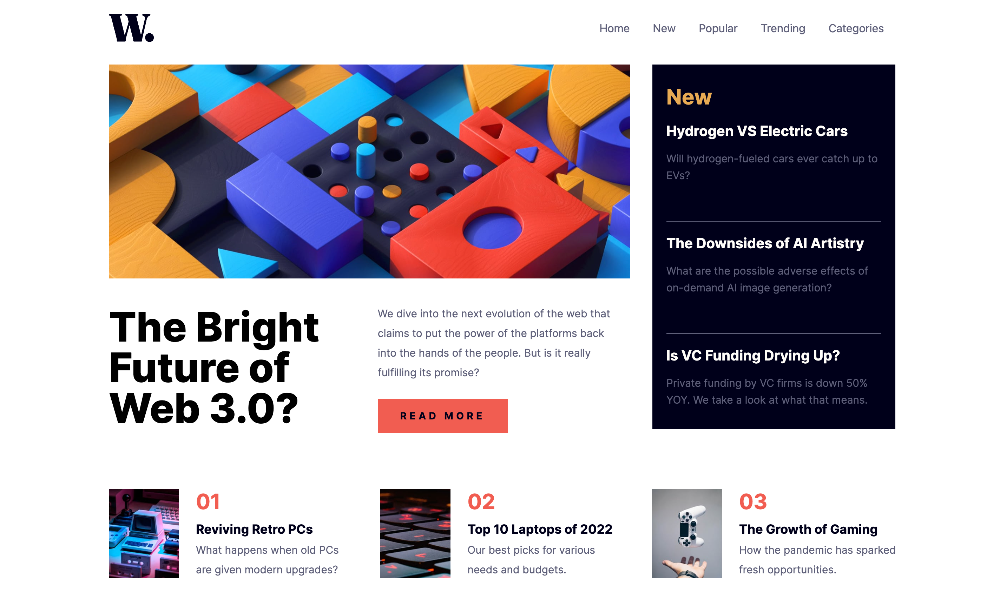
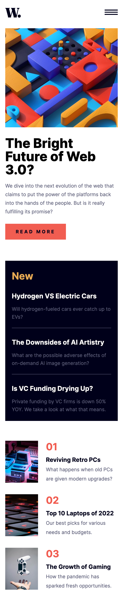

# 📰 News Homepage

Proyecto realizado como parte del reto [Frontend Mentor - News Homepage Challenge](https://www.frontendmentor.io/challenges/news-homepage-H6SWTa1MFl).  
El objetivo fue replicar un diseño dado, con comportamiento responsive y un menú hamburguesa interactivo.

---

## 🚀 Demo en vivo

🔗 **[Ver Proyecto Online](https://TU-LINK-AQUI.vercel.app)**

---

## 📸 Vista previa

**Versión Desktop**  


**Versión Mobile**  


---

## 🛠 Tecnologías utilizadas

- **React** – Librería para la interfaz.
- **Vite** – Entorno de desarrollo rápido.
- **Tailwind CSS 4.1** – Estilos y diseño responsive.
- **JavaScript ES6+**
- **HTML5 / CSS3**

---

## 📌 Funcionalidades

- Diseño responsive adaptable a cualquier dispositivo.
- Menú hamburguesa con animación y overlay.
- Hover states para todos los elementos interactivos.
- Layout fiel al diseño original provisto por Frontend Mentor.

---

## 📚 Lo que aprendí

- Configuración y uso de **Tailwind CSS 4.1** con colores y tipografías personalizadas.
- Manejo del estado con **React Hooks** (`useState`).
- Integración y optimización de imágenes y SVGs.
- Buenas prácticas en la estructura de componentes y carpetas.

---

## ⚙️ Instalación y uso

```bash
# Clonar el repositorio
git clone https://github.com/TU-USUARIO/TU-REPO.git

# Entrar en el directorio
cd TU-REPO

# Instalar dependencias
npm install

# Ejecutar en modo desarrollo
npm run dev
```
